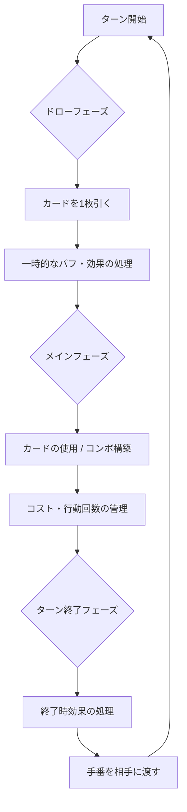

# 🎮 Long-2AGO

> **「バカゲー × カードゲーム」の新境地。**
> 1vs1で繰り広げられる、戦略と笑いのターン制カードバトルゲーム！

---

## 🌟 概要
`Long-2AGO` は、シンプルなルールの中に奥深いコンボシステムと、思わず笑ってしまうような「バカゲー」要素を融合させた対戦型カードゲームです。

### 📋 基本情報
| 項目 | 内容 |
| :--- | :--- |
| **ジャンル** | バカゲー × カードゲーム |
| **プレイ人数** | 2名（1vs1） |
| **勝利条件** | 相手プレイヤーのHPを0にする |
| **初期HP** | 100 |

---

## 🔄 ターンの流れ

---

## 🃏 カードの種類と仕様

### ⚔️ アクションカード（攻撃技）
バトルの要となるカード。コンボを繋ぐ「起点」と、大ダメージを狙う「終点」があります。

| カテゴリ | 特徴 | 効果 | コンボへの役割 |
| :--- | :--- | :--- | :--- |
| **ネクスト技** | 再行動系 | 行動回数を増加 | 起点・接続としての必須カード |
| **ワンショット技** | 高火力系 | 単発で高ダメージ | コンボの終盤・フィニッシャー |

### 🛡️ 武器 & バフカード
戦況を有利に進めるための補助リソース。

* **🗡️ 武器カード (装備型)**: 
  * 攻撃力の上昇や特定アクションの性能強化。
  * 同時装備数に制限があり、選択が重要。
* **✨ バフカード (強化型)**: 
  * 自己強化（攻撃・防御UP）や次手番の強化。
  * 「蓄積」することで爆発的な威力を発揮する成長要素あり。

---

## 🔥 コンボシステム & ダメージ計算

### ⛓️ コンボの定義
1ターン中に連続してカードを使用することで「コンボ」が発生。連鎖数（3, 4, 5...）に応じて、ダメージ倍率や追加効果が解放されます。

### 🔢 ダメージ計算（基本）
最終的なダメージは、装備やバフ、そして積み上げたコンボの集大成となります：

$$ \text{最終ダメージ} = (\text{カード基礎ダメージ} + \text{武器補正} + \text{バフ補正}) \times \text{コンボ倍率} $$

> [!IMPORTANT]
> 数値はバランス調整の段階にありますが、コンボ倍率による「逆転要素」がバカゲーとしての醍醐味です。

---

## 🧠 想定されるプレイ感と戦略

* **短時間決着**: スピーディな攻防で、サクッと遊べる。
* **読み合い**: 「今攻めるか、次に備えてバフを積むか」のジレンマ。
* **逆転劇**: 完璧なコンボが決まった時の爽快感。

---

## 🛠️ 開発ロードマップ (Current: Ver. 0.1)

- [ ] **カードカタログの作成**: 具体的な数値付きで20〜30枚の設計
- [ ] **計算式の微調整**: コンボ倍率表の確定
- [ ] **デジタルプロトタイプ**: Unity等を用いた実装の開始
- [ ] **拡張要素の検討**:
  - キャラクター固有能力
  - カウンター／防御システム
  - 属性相性の導入

---

### 👉 次のステップを選んでください
現在の仕様をより深掘りするために、以下のいずれかのアクションを推奨します。

1. **「カード具体例」**: 面白い技のアイデア出し
2. **「数値バランス」**: HPやダメージの具体的なシミュレーション
3. **「実装用仕様」**: プログラミングに向けた詳細データ構造の設計

---
© 2024 Long-2AGO Project

